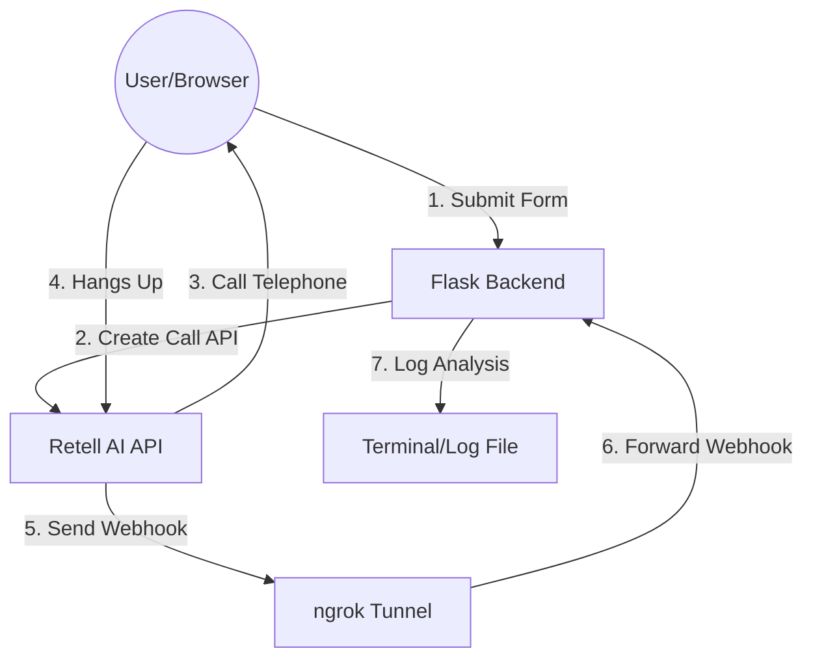

# Voice Agent with Retell AI

A sleek, responsive web application that initiates AI-driven voice calls and processes post-call analysis using Retell AI's V2 API.

## Features

- **Instant Outbound Calls**: Trigger calls directly from your browser.
- **Smart Analysis**: Captures "Reason for Leaving" and "Rejoin Interest" automatically.
- **Real-time Webhooks**: Processes post-call data via ngrok tunnel.
- **Modern UI**: Clean, responsive interface with glassmorphism effects.

## Architecture Flow



## Getting Started

### Prerequisites

- Python 3.10+
- [ngrok](https://ngrok.com/) account
- [Retell AI](https://www.retellai.com/) account (API Key, Agent ID, and Phone Number)

### Installation

1. **Clone the repository**:
   ```bash
   git clone <your-repo-url>
   cd voice-agent
   ```

2. **Install dependencies**:
   ```bash
   pip install -r requirements.txt
   ```

3. **Configure environment variables**:
   Create a `.env` file in the root directory:
   ```env
   RETELL_API_KEY=your_retell_api_key
   AGENT_ID=your_agent_id
   RETELL_FROM_NUMBER=+1234567890
   ```

### Running the App

1. **Start the Flask server**:
   ```bash
   python app.py
   ```

2. **Start ngrok tunnel**:
   ```bash
   ./ngrok http 5000
   ```

3. **Set Webhook URL**:
   Copy your ngrok forwarding URL (e.g., `https://xxxx.ngrok-free.dev`) and add it to your Agent's settings in the Retell Dashboard as:
   `https://xxxx.ngrok-free.dev/webhook`

## Project Structure

- `app.py`: Main Flask application (Backend)
- `templates/index.html`: Web interface (Frontend)
- `static/style.css`: Modern styling
- `.env`: API configuration (Keep it private!)
- `requirements.txt`: Python dependencies
- `README.md`: Project documentation

## Troubleshooting

### Recorded Data / Post-Call Analysis Not Appearing
If you successfully receive a call but the **Call Status**, **Reason for Leaving**, or **Rejoin Interest** fields are missing or empty:

1. **Wait for the Call to End**: Retell AI sends the webhook analysis **after** the call has completely disconnected.
2. **Dashboard Configuration**: Ensure your Retell Agent has **Post-Call Analysis** enabled. 
3. **Webhook URL**: Double-check that your ngrok URL + `/webhook` is correctly pasted into the **Webhook URL** field in the Retell Dashboard.
4. **Check Logs**: Monitor the `webhook_log.json` file in the project root to see the raw data being sent by Retell.

## Contributing

Feel free to open issues or submit pull requests to improve the agent's logic or design!

## License

MIT License
